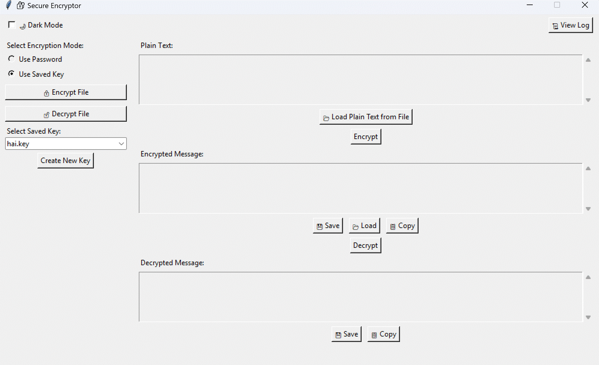

# 🔐 SecureEncryptor

A powerful and user-friendly desktop application for encrypting and decrypting messages and files using password-based or key-based encryption. Built with Python and Tkinter, it includes features like dark mode, logging, and GUI enhancements.

---



---

## ⚠️ Disclaimer

This application, **Secure Encryptor**, is provided "as-is" for educational and general-purpose use. While it offers encryption and decryption features using standard cryptographic libraries, it is **not intended for use in high-security or mission-critical environments without independent review and testing**.

By using this software, you acknowledge and agree that:

- You are solely responsible for any data encrypted, decrypted, lost, or shared using this tool.
- The author(s) are **not liable for any damages or losses** arising from the use or misuse of this application.
- This application does not claim to comply with any official security or compliance standards (e.g., HIPAA, GDPR, FIPS).
- Use of this application is entirely at your own discretion and risk.

Always back up your data before performing encryption or decryption. For high-security needs, consult professional-grade security tools and experts.

---

## ✨ Features

- 🔐 **Encrypt/Decrypt Messages**
- 📁 **Encrypt/Decrypt Files** with AES-based encryption (`Fernet`)
- 🔑 **Use Password or Saved Key** for flexible encryption modes
- 🌙 **Dark Mode** support
- 🧠 **Smart UI** with horizontal layout for better accessibility
- 🕒 **Auto-Clear Sensitive Data** from UI
- 📜 **History Logging** for encrypted/decrypted operations
- 💾 **Save/Load Messages to/from Files**
- 🔁 **Clipboard Support** (copy encrypted/decrypted text)
- 📦 **Ready for Packaging** with PyInstaller + Inno Setup

---

## 📂 Folder Structure

```
SecureEncryptor/
├── .gitignore
├── disclaimer.txt           ✅ Legal notice shown in installer
├── encryptor_gui.py         ✅ Main application script
├── LICENSE                  ✅ MIT license for open-source usage
├── lock.ico                 ✅ App icon
├── README.md                ✅ Full documentation
├── requirements.txt         ✅ Python dependencies
├── assets/
│   └── demo.gif             ✅ App demo preview (optional but helpful)
├── keys/                    ✅ Contains user-generated encryption key files used in "Saved Key" mode.
├── logs/                    ✅ Stores encryption and decryption history logs with timestamps.
├── output/                 
│   └── SecureEncryptorInstaller.exe    ✅ Self-contained installer to install the app with shortcuts and uninstaller support.
```
---

## 🚀 Getting Started

### 1. Clone the Repository
```bash
git clone https://github.com/190905186/SecureEncryptor.git
cd SecureEncryptor
````

### 2. Install Requirements

```bash
pip install cryptography
```

### 3. Run the App

```bash
python encryptor_gui.py
```

---


### 🖥️ Installing Secure Encryptor

To install the application using the prebuilt Windows installer ( The installer works only for windows):

1. **Download** the latest version of `SecureEncryptorInstaller.exe` from the [`output/`](output/) folder
2. **Double-click** the `.exe` file to launch the installer.
3. Follow the setup wizard:

   * Choose the installation directory (default is `C:\Program Files\Secure Encryptor`)
   * Optionally create a desktop shortcut
   * Accept the disclaimer to proceed
4. After installation, you can launch the app from:

   * The **Start Menu**
   * The **Desktop Shortcut** (if selected during install)

🔐 The app runs completely offline and does not send any data over the internet.

---

## 📃 License

This project is open-source under the [MIT License](LICENSE).

---

## 👨‍💻 Author

**Siva Sai**

Built using Python, Tkinter, and 💡 thoughtful design for real-world secure communication.

